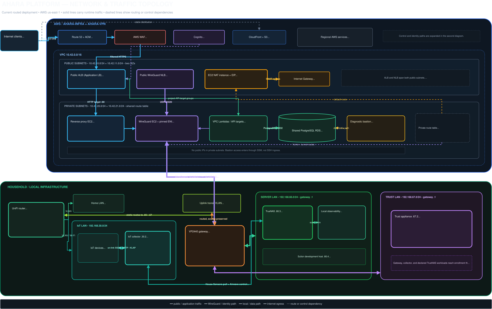
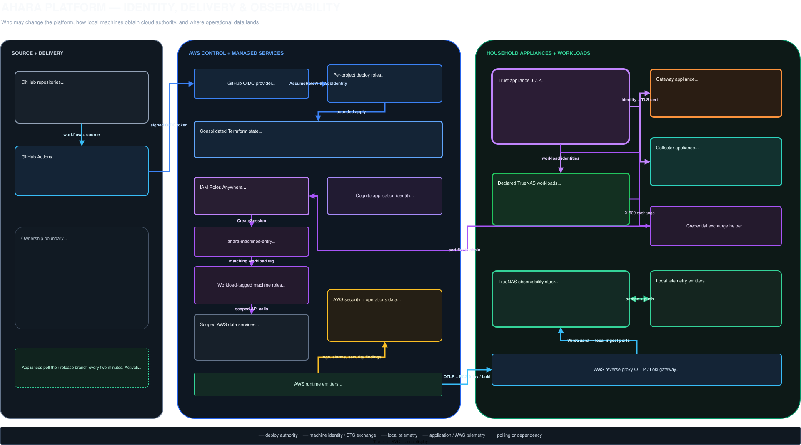

# Platform Architecture

Ahara spans an AWS control and service plane plus routed household networks. The two views below separate runtime traffic from deployment, machine identity, and observability so the network path remains readable.

## Network and traffic topology

The network view includes the public edge, both VPC subnet tiers, the ALB and WireGuard NLB, the EC2 NAT instance, the diagnostic bastion, private compute and data services, and the routed household zones.



[Open the full-size network diagram](diagrams/platform-network.svg) · [Edit the Draw.io source](diagrams/platform-network.drawio)

### Primary traffic paths

| Path | Route |
| --- | --- |
| Public applications | Internet client → Route 53/ACM → WAF → public ALB → project Lambda target or private reverse-proxy EC2. TrueNAS-backed routes continue through the WireGuard EC2 endpoint, the tunnel, and the VP2440 to `192.168.66.3`. |
| Site tunnel | `wg.ahara.io` → public UDP NLB in both public subnets → WireGuard EC2 with a pinned private ENI → VP2440 peer `10.200.0.2`. The tunnel carries declared AWS and server-LAN routes, not default internet traffic. |
| Private AWS egress | The shared private route table sends `0.0.0.0/0` to the NAT instance ENI, then its EIP and the Internet Gateway. The current NAT forwarding rule admits `10.42.20.0/24`; the route table is also associated with `10.42.21.0/24`. |
| AWS diagnostics | The bastion sits in private subnet B with the Lambda security group. Operators start an SSM Session Manager session; it has no public address or SSH ingress and stops after 60 minutes. |
| Local routed traffic | UniFi owns WAN NAT, Home/IoT VLANs, and static routes. Traffic for the server and trust networks crosses the uplink transit VLAN to the VP2440, which applies named, default-drop nftables flows without NAT. |
| IoT collection | The collector and devices share `192.168.30.0/24`, so SSDP, environment-sensor discovery, and Kasa polling stay on-link. TrueNAS reaches the collector through the VP2440 to pull readings and drive Airwave's constrained device transport. |

## Identity, delivery, and observability

This view separates application authentication from machine identity. Cognito authenticates people and M2M clients. The trust appliance issues local machine identities; IAM Roles Anywhere exchanges an allowed X.509 identity for short-lived, workload-specific AWS authority.



[Open the full-size control diagram](diagrams/platform-control.svg) · [Edit the Draw.io source](diagrams/platform-control.drawio)

### Authority and operations paths

| Path | Route |
| --- | --- |
| AWS deployment | GitHub Actions presents repository and ref claims to the GitHub OIDC provider, assumes the matching per-project deploy role, and applies the bounded Terraform scope. The `ahara-infra` control, network, and services layers share `ahara/infra.tfstate`; the AWS WireGuard endpoint remains owned by `ahara-vpn`. |
| Appliance delivery | CI advances each appliance's `release` ref. Gateway, trust, and collector poll every two minutes, build locally, activate only after health checks, and roll back a failed generation. |
| Local machine identity | The trust appliance keeps the private CA key on `192.168.67.2`. It enrolls only workload IDs declared in `ahara-trust`; renewal requires a valid client certificate and current policy. |
| AWS machine authority | A declared local workload exchanges its certificate through IAM Roles Anywhere for the entry role, then assumes only a machine role tagged for that workload ID. The collector deliberately has no AWS credential. |
| Certificates | The trust appliance uses its scoped machine role for Route 53 DNS-01 and acquires `*.local.ahara.io`. Only the gateway and collector receive that TLS keypair; other TrueNAS workloads receive their own machine identities. |
| Observability | AWS security and service logs land in CloudWatch and the security-log bucket. OTLP-enabled Lambdas and EC2 Alloy agents use the private reverse proxy as the OTLP/Loki gateway, which forwards over WireGuard to Grafana, VictoriaMetrics, Loki, and Tempo on TrueNAS. Local gateway, collector, and workload telemetry lands in the same local stack. |

## Construct boundaries

| Construct | Owns | Boundary |
| --- | --- | --- |
| AWS platform (`ahara-infra`) | VPC, two public and two private subnets, route tables, Internet Gateway, EC2 NAT, public ALB, WAF/ACM/Route 53, private reverse proxy, diagnostic bastion, Cognito, VPC Lambdas, RDS, deployment IAM, Roles Anywhere, and shared AWS data services | Private VPC routes reach the household server subnet through the WireGuard ENI. The bastion reproduces the Lambda network position for SSM-only diagnostics. Machine credentials come from workload-tagged roles, not shared static keys. |
| AWS WireGuard endpoint (`ahara-vpn`) | Public UDP NLB, WireGuard EC2 instance and pinned ENI, tunnel identities, peer configuration, and endpoint DNS | The NLB exposes UDP `51820`; the EC2 endpoint lives in the primary private subnet. The tunnel carries `10.200.0.0/24` and declared private routes. |
| UniFi router | WAN edge and internet NAT, Home, IoT, and uplink VLANs, Wi-Fi, and static routes for networks behind the VP2440 | The household's default internet path stays here. It does not replace the VP2440's inter-zone policy. |
| VP2440 gateway (`ahara-vpn`) | Server and trust gateways, WireGuard, internal DNS, server DHCP, default-drop nftables policy, flow counters, and Suricata inspection | It routes without NAT. Home and IoT traffic arrive on the uplink with original source addresses and may cross zones only through declared flows. |
| Trust appliance (`ahara-trust`) | Private CA, workload allowlist, enrollment and renewal, wildcard ACME acquisition, and certificate distribution | The CA key remains on `192.168.67.2`. Firewall reachability, the workload allowlist, and matching IAM role tags must agree before an identity gains useful authority. |
| IoT collector (`ahara-collector`) | On-link device discovery, constrained WiiM transport, environment/Kasa polling, device credentials, scoped consumer tokens, and bounded per-module spools | It has no cloud credential and does not write upstream databases. TrueNAS consumers pull readings and own the InfluxDB write and Airwave state. |
| TrueNAS server plane | Airwave, House Sensors, application containers, Komodo deployments, data stores, and the local observability stack | Public traffic for routed TrueNAS applications arrives through the AWS reverse proxy and WireGuard. Each AWS-enabled workload enrolls separately and assumes its own scoped role. |

## Current feature gates

- Trust certificate automation is enabled. The optional trust management console, browser terminal, and S3 secret-store backup are disabled.
- The gateway configuration API is disabled. Routing, DNS, DHCP, inspection, and WireGuard operate independently of it.
- The collector serves its authenticated TLS API on `8443`; plain `8850` remains for the House Sensors puller that has not moved to TLS.

## Maintaining the diagrams

The `.drawio` files are the editable sources and the `.svg` files are checked-in renders. Rebuild both SVGs from the repository root with:

```bash
docker run --rm \
  -v "$PWD/docs/diagrams:/input:ro" \
  -v "$PWD/docs/diagrams:/output" \
  rlespinasse/drawio-export:v4.52.0 \
  -f svg -o /output --remove-page-suffix --embed-svg-fonts false /input
```

## Sources of truth

| Area | Repository path |
| --- | --- |
| AWS control, network, and services | `../ahara-infra/infrastructure/terraform/` |
| AWS WireGuard endpoint | `../ahara-vpn/infrastructure/terraform/` |
| Gateway topology and flow policy | `../ahara-vpn/hosts/gateway/topology.json`, `../ahara-vpn/hosts/gateway/site.nix` |
| Trust topology and identity policy | `../ahara-trust/hosts/trust/topology.json`, `../ahara-trust/hosts/trust/site.nix` |
| Collector topology and service boundary | `../ahara-collector/hosts/collector/topology.json`, `../ahara-collector/docs/architecture.md` |
| Platform integration contracts | `INTEGRATION.md`, `TRUENAS-DEPLOY.md`, `OBSERVABILITY.md` |
| Editable diagram sources | `docs/diagrams/platform-network.drawio`, `docs/diagrams/platform-control.drawio` |
