# Platform Architecture

Ahara spans an AWS control and service plane plus routed household networks. The diagram emphasizes the paths that cross trust boundaries: public ingress, the WireGuard link, local inter-zone flows, IoT collection, and certificate-backed machine identity.

## Cloud and local topology

```mermaid
flowchart LR
    users((Internet users))
    github["GitHub<br/>Actions and release refs"]

    subgraph aws["AWS us-east-1"]
        direction TB
        edge["Route53 + ACM + WAF<br/>public ALB"]
        cognito["Cognito<br/>human and M2M authentication"]
        services["Private VPC services<br/>reverse proxy · Rust Lambdas · RDS<br/>10.42.20.0/23"]
        wireguard["WireGuard endpoint<br/>UDP NLB → EC2 pinned ENI<br/>10.200.0.1"]
        deploy["GitHub OIDC<br/>per-project deploy roles"]
        roles["Roles Anywhere + STS<br/>workload-tagged IAM roles"]
        awsdata["SSM Parameter Store<br/>Route53 · S3/KMS · CloudWatch"]

        cognito -. authenticates .-> edge
        edge --> services
        services -->|"route to 192.168.66.0/24"| wireguard
        deploy --> edge
        deploy --> services
        deploy --> roles
        roles -->|"scoped, short-lived sessions"| awsdata
    end

    subgraph local["Household and local infrastructure"]
        direction TB
        unifi["UniFi router<br/>internet NAT · VLANs · static routes"]
        home["Home LAN<br/>192.168.65.0/24"]
        iot["IoT LAN<br/>192.168.30.0/24"]
        devices["WiiM players<br/>AtomS3U sensors · Kasa plugs"]
        collector["Collector · 192.168.30.2<br/>on-link discovery and control<br/>bounded reading spools"]
        transit["Uplink transit<br/>192.168.60.0/24"]
        gateway["VP2440 gateway · 192.168.60.2<br/>NixOS · DNS/DHCP · nftables + Suricata<br/>routed, default-drop, no NAT"]
        servers["Server LAN<br/>192.168.66.0/24 · gateway .1"]
        truenas["TrueNAS · 192.168.66.3<br/>Airwave · House Sensors · app containers"]
        observe["Local observability<br/>Grafana · VictoriaMetrics · Loki<br/>Tempo · InfluxDB"]
        trustnet["Trust LAN<br/>192.168.67.0/24 · gateway .1"]
        trust["Trust appliance · 192.168.67.2<br/>private CA · machine enrollment<br/>public wildcard ACME certificate"]

        unifi --- home
        unifi --- iot
        iot --- devices
        iot --- collector
        unifi --- transit
        transit --- gateway
        gateway --- servers
        servers --- truenas
        truenas --- observe
        gateway --- trustnet
        trustnet --- trust

        devices <-->|"on-link SSDP · HTTP · KLAP"| collector
        truenas -->|"HTTPS 8443<br/>Airwave control + sensor drain"| collector
        devices -->|"Airwave media · TCP 7882"| truenas
        gateway -->|"machine identity<br/>HTTPS 8443"| trust
        collector -->|"machine identity + public TLS cert<br/>HTTPS 8443"| trust
        truenas -->|"workload identity enrollment<br/>HTTPS 8443"| trust
        observe -->|"metrics scrape"| gateway
        observe -->|"metrics scrape"| collector
        gateway -->|"logs"| observe
    end

    users --> edge
    users --> unifi
    github -->|OIDC| deploy
    wireguard <-->|"WireGuard · UDP 51820<br/>10.200.0.1 ↔ 10.200.0.2"| gateway
    trust -->|"X.509 exchange over public AWS APIs<br/>DNS-01; not the tunnel"| roles
    truenas -->|"declared workload X.509 exchange<br/>public AWS APIs"| roles
    gateway -.->|"polls release"| github
    collector -.->|"polls release"| github
    trust -.->|"polls release"| github

    classDef cloud fill:#e8f1ff,stroke:#2563eb,color:#0f172a
    classDef localNode fill:#ecfdf5,stroke:#059669,color:#0f172a
    classDef gatewayNode fill:#fff7ed,stroke:#ea580c,color:#0f172a
    classDef trustNode fill:#f5f3ff,stroke:#7c3aed,color:#0f172a
    classDef collectorNode fill:#ecfeff,stroke:#0891b2,color:#0f172a

    class edge,cognito,services,wireguard,deploy,roles,awsdata cloud
    class unifi,home,iot,devices,transit,servers,truenas,observe,trustnet localNode
    class gateway gatewayNode
    class trust trustNode
    class collector collectorNode
```

## Construct boundaries

| Construct | Owns | Boundary |
| --- | --- | --- |
| AWS platform (`ahara-infra`) | VPC and routes, ALB/WAF/Route53, reverse proxy, Cognito, Lambdas, RDS, deployment IAM, Roles Anywhere, and shared AWS data services | Private VPC routes reach the household server subnet through the WireGuard ENI. Machine credentials come from workload-tagged roles, not shared static keys. |
| WireGuard (`ahara-vpn`) | Public UDP NLB, EC2 tunnel endpoint and pinned ENI, tunnel identities, and the local gateway peer | The tunnel carries `10.200.0.0/24` and declared private VPC routes. It is not the household's default internet route. |
| UniFi router | Internet NAT, the home, IoT, and uplink VLANs, and static routes for networks behind the VP2440 | Internet egress is NATed here. Inter-zone authorization remains on the VP2440 for traffic routed through it. |
| VP2440 gateway (`ahara-vpn`) | Server and trust gateways, WireGuard, internal DNS, server DHCP, default-drop nftables policy, named flow counters, and Suricata inspection | It performs routed firewalling without NAT. Home and IoT traffic share the uplink interface but remain distinct source zones. |
| Trust appliance (`ahara-trust`) | Private CA, workload allowlist, enrollment and renewal, shared publicly trusted certificate acquisition, and certificate distribution | The CA key remains on `192.168.67.2`; AWS receives only the public CA. Firewall reachability, the workload allowlist, and matching IAM role tags all have to agree. |
| IoT collector (`ahara-collector`) | On-link device discovery, constrained WiiM transport, environment/Kasa polling, device credentials, scoped consumer tokens, and bounded per-module spools | It has no cloud credential and does not write upstream databases. TrueNAS pulls readings and owns the InfluxDB write. |
| TrueNAS server plane | Airwave, House Sensors, application containers, Komodo deployments, data stores, and the local observability stack | Public traffic for routed TrueNAS applications arrives through the AWS reverse proxy and WireGuard. Declared workloads enroll separately and use their own scoped AWS roles. |

## Current feature gates

- Trust certificate automation is enabled. The optional trust management console, terminal, and S3 secret-store backup are disabled in the current topology.
- The gateway configuration API is disabled. Routing, DNS, DHCP, inspection, and WireGuard operate independently of that surface.
- The collector serves its authenticated TLS API on `8443`; the plain `8850` path remains only for the House Sensors puller that has not moved to TLS.

## Sources of truth

| Area | Repository path |
| --- | --- |
| AWS control, network, and services | `../ahara-infra/infrastructure/terraform/` |
| AWS WireGuard endpoint | `../ahara-vpn/infrastructure/terraform/` |
| Gateway topology and flow policy | `../ahara-vpn/hosts/gateway/topology.json`, `../ahara-vpn/hosts/gateway/site.nix` |
| Trust topology and identity policy | `../ahara-trust/hosts/trust/topology.json`, `../ahara-trust/hosts/trust/site.nix` |
| Collector topology and service boundary | `../ahara-collector/hosts/collector/topology.json`, `../ahara-collector/docs/architecture.md` |
| Platform integration contracts | `INTEGRATION.md`, `TRUENAS-DEPLOY.md`, `OBSERVABILITY.md` |
